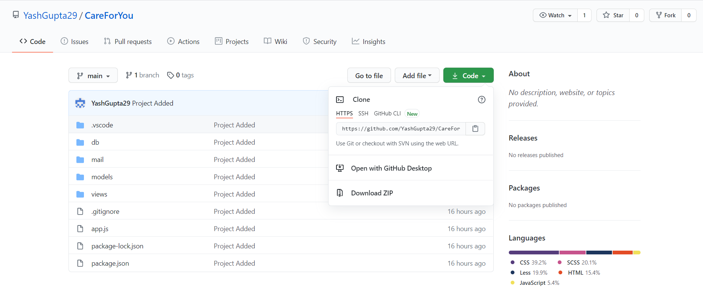

# 🏥 CareForYou


-> Description about CareForYou

## 👇 Download Files
* go to our github repository: https://github.com/YashGupta29/CareForYou
* Download Zip or clone repo



* Either download the ZIP file and unpack it or clone with git
* Then open the folder in your favourite IDE 

## ✌️ Install the App

```shell
# run yarn install or npm install
npm install
```

## 😻 Run CareForYou

```bash
# to start CareForYou, type
npm start
# or if you prefer yarn
yarn start
```
Runs the app in the development mode.\
Open [http://localhost:3000](http://localhost:3000) to view it in the browser.

The page will reload if you make edits.\

Restart your app *(ctrl+c),* then `npm start` aaaaaand you're done - test it and please tell us how it worked 🖖 🎉

---


